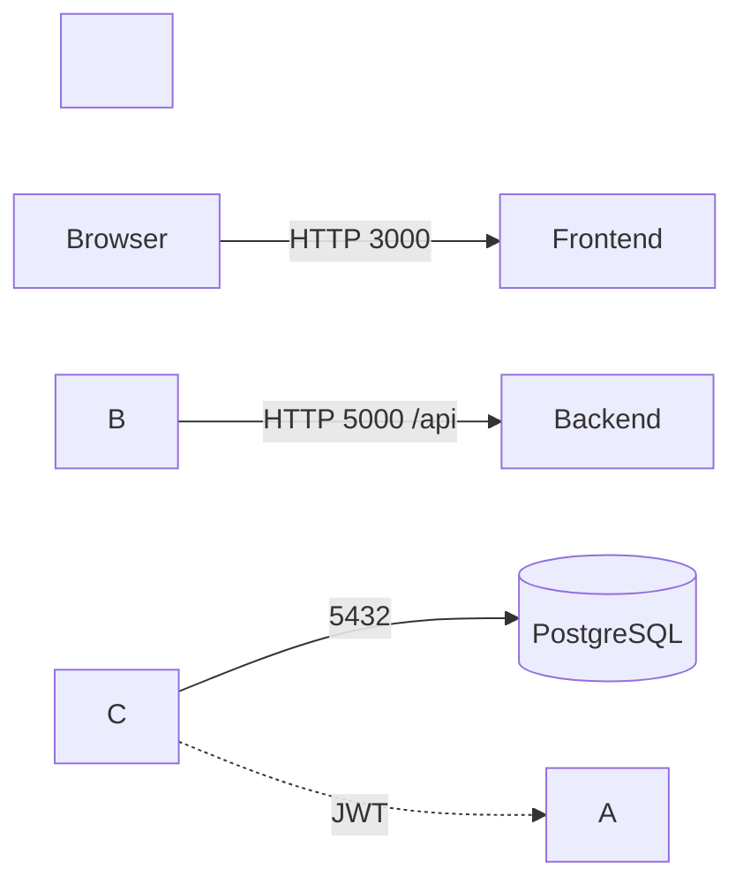

\# Architecture


\## System Architecture Diagram

\- Browser (React SPA) → Backend (Express API) → PostgreSQL (database)

\- JWT Auth flow: Login issues token; subsequent requests include Authorization: Bearer <token>

\- CORS allows origin FRONTEND\_URL; services communicate via Docker service names


A Mermaid diagram is included below; export to PNG for final docs:





\## Database ERD

```mermaid

erDiagram

&nbsp; tenants ||--o{ users : has

&nbsp; tenants ||--o{ projects : has

&nbsp; tenants ||--o{ audit\_logs : has

&nbsp; projects ||--o{ tasks : has

&nbsp; users ||--o{ projects : created\_by

&nbsp; users ||--o{ tasks : assigned\_to


&nbsp; tenants {

&nbsp;   uuid id PK

&nbsp;   string name

&nbsp;   string subdomain

&nbsp;   enum status

&nbsp;   enum subscription\_plan

&nbsp;   int max\_users

&nbsp;   int max\_projects

&nbsp;   timestamptz created\_at

&nbsp;   timestamptz updated\_at

&nbsp; }

&nbsp; users {

&nbsp;   uuid id PK

&nbsp;   uuid tenant\_id FK

&nbsp;   string email

&nbsp;   string password\_hash

&nbsp;   string full\_name

&nbsp;   enum role

&nbsp;   bool is\_active

&nbsp;   timestamptz created\_at

&nbsp;   timestamptz updated\_at

&nbsp; }

&nbsp; projects {

&nbsp;   uuid id PK

&nbsp;   uuid tenant\_id FK

&nbsp;   string name

&nbsp;   text description

&nbsp;   enum status

&nbsp;   uuid created\_by FK

&nbsp;   timestamptz created\_at

&nbsp;   timestamptz updated\_at

&nbsp; }

&nbsp; tasks {

&nbsp;   uuid id PK

&nbsp;   uuid project\_id FK

&nbsp;   uuid tenant\_id FK

&nbsp;   string title

&nbsp;   text description

&nbsp;   enum status

&nbsp;   enum priority

&nbsp;   uuid assigned\_to FK

&nbsp;   date due\_date

&nbsp;   timestamptz created\_at

&nbsp;   timestamptz updated\_at

&nbsp; }

&nbsp; audit\_logs {

&nbsp;   uuid id PK

&nbsp;   uuid tenant\_id FK

&nbsp;   uuid user\_id FK

&nbsp;   string action

&nbsp;   string entity\_type

&nbsp;   string entity\_id

&nbsp;   string ip\_address

&nbsp;   timestamptz created\_at

&nbsp; }

```


\## API Architecture

\- Auth: POST /api/auth/register-tenant, POST /api/auth/login, GET /api/auth/me, POST /api/auth/logout

\- Tenants: GET /api/tenants/:tenantId, PUT /api/tenants/:tenantId, GET /api/tenants (super\_admin)

\- Users: POST /api/tenants/:tenantId/users, GET /api/tenants/:tenantId/users, PUT /api/users/:userId, DELETE /api/users/:userId

\- Projects: POST /api/projects, GET /api/projects, PUT /api/projects/:projectId, DELETE /api/projects/:projectId

\- Tasks: POST /api/projects/:projectId/tasks, GET /api/projects/:projectId/tasks, PATCH /api/tasks/:taskId/status, PUT /api/tasks/:taskId


Auth requirements and roles are enforced per endpoint as specified. 

